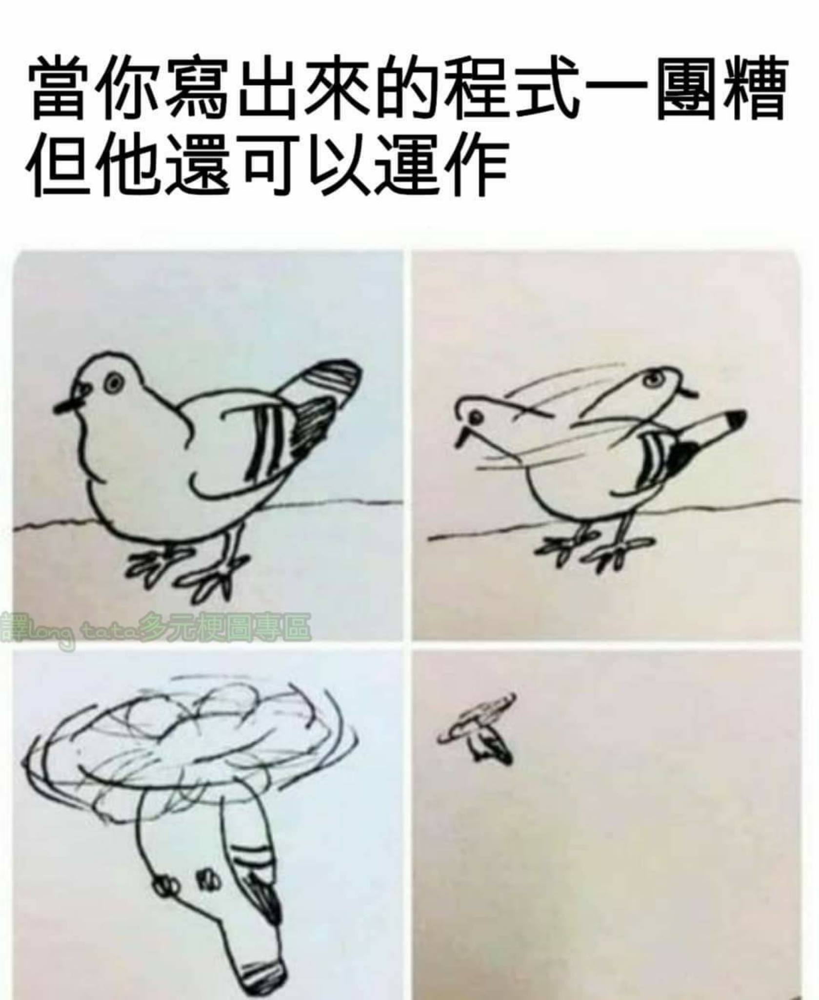

# 2024 NTHU Operating System Homework
## 前言
這是2024上學期清大周志遠作業系統的作業 ( NachOS 的 Trace code 與實作) 留檔，希望能幫到你，預祝你能順利通過這門課拿 A+ ( 這不是我 )

**不過程式的對錯我沒辦法完全保證，我只能保證我實作部分有通過當時的自我檢測，但是不是真的對我不敢說百分百的肯定**

然後每份作業我都有附上我的成績與評語(但我 demo 成績偏慘烈，我很抱歉)，建議你看一下再決定應該怎麼**參考**

## 說明

* Report&Spec 放的是我的報告 ( Report ) 跟作業的說明 ( Spec ) 
* unmodified_code 放的是未經修改的程式壓縮檔
* 其他的是修改過 ( 實作完成 ) 的程式碼
* 然後由於轉檔的效果不是很好，字有點小 ( 我很抱歉 ) ，所以建議可以下載 .ipynb 檔案放上 colab 看 ( 我當初是用 colab 寫的 ) 或者其他的都可以

## 其他參考資料
**注意每年要求會有點不一樣，記得看看 spec 裡面怎麼寫的，了解一下比較好**

* 這個算我覺得最有幫助的
https://github.com/shawn2000100/10810CS_342301_OperatingSystem

* 這個實作方式很複雜
https://github.com/Shiritai/NTHU-Operating-System-Eroiko_Blue

* 這個沒有 Report
https://github.com/KangMingHsi/OS_Project/tree/master

* 這個年代有點有點久遠
https://morris821028.github.io/categories/%E5%AD%B8%E6%A0%A1%E8%AA%B2%E7%A8%8B/%E4%BD%9C%E6%A5%AD%E7%B3%BB%E7%B5%B1/

## 最後
以下是做作業時各個階段的我

