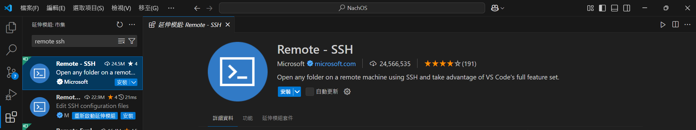

# 說明
這裡就是放作業 report 跟 spec 的地方
# 其他我覺得有點用的
## 如何寫 bash 檔幫助你重新編譯與測試
舉例來說

```bash
#!/bin/bash
echo "Running auto_gen_transformer..."
./scripts/auto_gen_transformer --input ./tests/00_spec.json --output transformer.cpp
echo "Running make clean..."
make clean
echo "Running make with devtoolset-8..."
scl enable devtoolset-8 'make'
echo "Running main with parameters 200 ./tests/00.in ./tests/00.out..."
time ./main 200 ./tests/00.in ./tests/00.out
echo "Running verify script..."
./scripts/verify --output ./tests/00.out --answer ./tests/00.ans
echo "All steps completed."
```
### 解說上面 bash 檔大概在幹嘛
首先，你要確認你在哪個檔案裏執行，比如說上面的程式碼是在 NTHU-OS-Pthreads 檔案夾裡面 ( 這個找的到叫 auto_test00.sh 就在我 NTHU-OS-Pthreads 裡面，你可以去看 )

#### 第一行
```bash
#!/bin/bash
```
後來感覺好像不是很重要，因為我不加也能跑，但我查網路資料都叫我加

#### 第二行
```bash
echo "Running auto_gen_transformer..."
```
是用來輸出訊息的，由於執行 bash 檔時並不會像我們一樣輸入指令，所以在終端機介面不會有訊息讓我們掌握執行到什麼指令了 ( 但是指令自帶的輸出還是會有，比如說你 make 那些編譯器執行的輸出還是會有，只是不會有顯示 make 就這樣 ) ，所以適時加入像下面這樣的指令
```bash
echo "你想加(輸出)的消息"
```
這樣你便能比較清楚掌握現在在跑什麼，跑到哪一行了

#### 第五行
```bash
make clean
```
就是你要執行什麼就寫什麼 ( 你在終端機裡怎麼打，就在 bash 檔裡怎麼打 )，像我這樣就是在 NTHU-OS-Pthreads 檔案夾中執行 make clean ( 所以上面跟你說了確認你在哪個檔案中執行 bash 檔有差，要不然你就在前面加 cd 絕對路徑 去進到指定資料夾 )

#### 第九行
```bash
time ./main 200 ./tests/00.in ./tests/00.out
```
這個是執行下面的指令，只是前面加上 time 可以測量下面程式執行時間，那其實 bash 還提供很多功能，你就自己去探索吧
```bash
./main 200 ./tests/00.in ./tests/00.out
```

如何寫註解，就打上 # 之後的東西就變註解，例如 : 
```bash
# 這是註解
```

### 舉個例子吧
下面是 MP2 的指令教學在 MP2 spec 中能找到


OK 那通常我們最常需要的是重新編譯，所以你可以在 test 檔案夾裡寫 bash 檔( 我是這樣做，當然你也可以寫在其他的地方，然後這個範例我沒有傳上 github ，不像上面解說的有在其中某個資料夾 ) ，如下

```bash
#!/bin/sh
# 從 test 資料夾進到 build.linux 資料夾，所以如果你不是寫在 test 資料夾，那你得自己看相對路徑，或者絕對路徑應該怎麼寫
cd ../build.linux
# 輸入指令清除舊的編譯後的檔案
make clean
# 重新編譯
make
# 從 build.linux 資料夾進到 test 資料夾
cd ../test
# 執行指定測試
../build.linux/nachos -e consoleIO_test1 -e consoleIO_test2
```
然後你取名假設叫 XX.sh ( XX 是你命的名字 )，在這邊我叫 auto.sh

你要在終端機下指令，這樣你的 bash 檔才能獲取執行權限 ( 現在在 test 資料夾中，因為我寫在 test 資料夾中 )

```bash
chmod +x auto.sh
```

你如果叫不同名字那就是( XX 是你命的名字自行替換 )

```bash
chmod +x XX.sh
```

那最後，你就可以在終端機中( 現在在 test 資料夾中 ) 輸入

```bash
./auto.sh
```

或者你如果叫不同名字那就是( XX 是你命的名字自行替換 )

```bash
./XX.sh
```

這樣你看，你就可以只輸一行指令執行五行指令，幫助你重新編譯並執行測試，不用在那複製貼上，多好，就問你是不是 ( 尤其是你重複修改多次時，我非常有感，嗚嗚，不要罵了，我知道我菜 )

或者，下面這個是本身提供的 ( 在 MP1, MP2, MP3 的 code/test 資料夾裡面可以找到，但只能幫你重新編譯 NachOS 不能執行測試，叫做 build_nachos.sh ，功能非常多，但是要注意的是，他默認是不會 make clean ，所以你想要下指令重新編譯要下 ./build_nachos.sh -c 不然你就自己魔改一下，然後順便加上測試的指令，這樣也行 )

```bash
#!/bin/sh

# Default values for flags
QUIET=false
JOBS=1
CLEAN=false

# Show usage/help message
show_help() {
    echo "Usage: $0 [-q] [-j] [-c] [-h|--help]"
    echo
    echo "Options:"
    echo "  -q        Silence output"
    echo "  -j        Run make with multiple jobs (uses all available cores)"
    echo "  -c        Clean before building"
    echo "  -h, --help Display this help message"
    exit 0
}

# Parse flags
while getopts "qjch-:" opt; do
    case $opt in
        q)
            QUIET=true
            ;;
        j)
            JOBS=$(nproc)  # Use all available cores by default
            ;;
        c)
            CLEAN=true
            ;;
        h)
            show_help
            ;;
        -) # Handle long options
            case "${OPTARG}" in
                help)
                    show_help
                    ;;
                *)
                    echo "Invalid option: --${OPTARG}"
                    exit 1
                    ;;
            esac
            ;;
        *)
            echo "Usage: $0 [-q] [-j] [-c] [-h|--help]"
            exit 1
            ;;
    esac
done

# Move to the build directory
cd ../build.linux || exit

# Clean build if -c flag is set
if [ "$CLEAN" = true ]; then
    echo "Cleaning..."
    if [ "$QUIET" = true ]; then
        make clean > /dev/null 2>&1
    else
        make clean
    fi
fi

# Build nachos
echo "Building with $JOBS job(s)..."
if [ "$QUIET" = true ]; then
    make -j"$JOBS" > /dev/null 2>&1
else
    make -j"$JOBS"
fi

# Check build result
if [ $? -eq 0 ]; then
    echo "Build success"
else
    echo "Build failed"
    exit 1
fi
```

## 如何實現免密碼登入 ( Windows )
### 方法一
首先，打開 **Windows Powershell** 輸入 ( 由於 Windows 其實有兩個終端機，舊的叫 cmd 新的叫 Powershell 有部分指令不一樣 )

```powershell
ssh-keygen
```

此時會詢問3個問題：

* Enter file in which to save the key
* Enter passphrase
* Enter same passphrase again

基本上是問你生成的 key 存哪，然後是存的資料夾要不要設密碼 ( 要的話記得輸兩次一樣的 )，最簡單就是連按三次 Enter 這樣就是會自動生成資料夾儲存，以及不設密碼，當然理論上是設個密碼比較好，比較能保護隱私

然後輸入下面指令

```powershell
Get-Content $env:userprofile\.ssh\id_rsa.pub
```

這樣會跳出一堆文字，那是你的 pubilc key ，全選複製，( 從 ssh 到 email 全部都要選到 )

然後連線到你的遠端控制台 ( 應該會長下面這樣 ) 之後輸入


```bash
cd ~
mkdir .ssh
cd .ssh
vim authorized_keys
```

然後按 s 進入編輯模式 ( **如果已經有東西了，要注意按 s 會吃掉一個字，記得幫忙補回去，然後按往右的方向鍵到最尾端按 Enter 換行** )，把你複製的 pubilc key 貼上去 ( 按滑鼠右鍵，然後選 paste 因為在 vim 中 ctrl + v 不會貼上 ) ，貼好了之後按 Esc ，然後輸入 **:wq** ( 就是輸入 :wq 冒號不準省略，阿如果你手殘，輸入 :q! 之後重新執行一遍 ) 最後記得按 Enter ，這樣你就完成了 ( :wq 代表儲存並退出 :q! 代表不儲存並退出 )

如果看到 mkdir: cannot create directory ‘.ssh’: File exists 不用慌張，當作沒看到就好
### 方法二
首先，打開 **Windows Powershell** 輸入 ( 由於 Windows 其實有兩個終端機，舊的叫 cmd 新的叫 Powershell 有部分指令不一樣 )

```powershell
ssh-keygen
```

此時會詢問3個問題：

* Enter file in which to save the key
* Enter passphrase
* Enter same passphrase again

基本上是問你生成的 key 存哪，然後是存的資料夾要不要設密碼 ( 要的話記得輸兩次一樣的 )，最簡單就是連按三次 Enter 這樣就是會自動生成資料夾儲存，以及不設密碼，當然理論上是設個密碼比較好，比較能保護隱私

然後輸入下面指令， nachos 記得換成你的帳號，或者你有設定好了那當我沒說

```powershell
Get-Content $env:userprofile\.ssh\id_rsa.pub | ssh nachos "cat >> ~/.ssh/authorized_keys"
```

比如說，我是 os24team59 那我的輸入會像下面這樣

```powershell
Get-Content $env:userprofile\.ssh\id_rsa.pub | ssh os24team59@192.168.5.2 "cat >> ~/.ssh/authorized_keys"
```

然後再輸入你伺服器的密碼就完成啦，但這個方法需要你有裝 ssh ，不然就會像我下面這樣，但 openssh 怎麼裝我也不太會，就靠你自己研究了


如果想知道 Powershell 跟 cmd 有什麼差可以稍微看下這影片，這樣你就大概能了解上面在幹嘛
https://youtu.be/u0yKHP0onwU?si=3aUuIsz-dY9o9P92

參考其他大佬的免密碼登入教學:
https://hackmd.io/@QMYMj19MQTakfoKkZZO3jg/SJErCdJLi#1-%E8%AE%8A%E6%9B%B4hostname
## VScode ssh remote
就是使用終端機編輯檔案其實不太好用，用個圖形化介面會好多了，所以我來講一下應該怎麼搞 ( 記得你的 WireGuard 要連著 )

首先，打開 VScode 點擊下面這個圖示 ( 或 Ctrl + Shift + X )


然後搜尋 remote ssh 安裝下方圖片的那個 ( Remote - SSH ) 延伸模組


安裝它，點就對了



至於為什麼我有中文介面，那也是延伸模組，去找下面這個安裝就行


然後我們應該如何連線?

首先，點擊左下角 ( 下面圖片的那個東西 )


然後你應該會跳出下方圖片的東西，點擊 Connect to Host...


然後點擊設定 SSH 主機


然後點 config 那個


然後它應該就會打開一個文件，輸入如下 ( 記得存檔 )

```
Host nachos
  HostName 192.168.5.2
  User os24team59
```

Host 後面是輸入你這個要叫什麼，叫什麼都可以

HostName 後面是輸入地址，就是輸入 @ 後面的東西

User 後面輸入使用者，就是輸入 @ 前面的東西 ( **記得你要改成你的帳號，你輸入 os24team59 一定連不到** )

那理論上，當你設定完成後下面指令 ( 在你終端機裡 )

```bash
ssh os24team59@192.168.5.2
```

就可以換成下面的 ( nachos 是因為我 Host 後面輸入 nachos 代表我的叫 nachos 你就看你的叫什麼就輸入什麼 )

```bash
ssh nachos
```

好了，這時你存完檔了，點擊左下角 ( 下面圖片的那個東西 )


點擊 Connect to Host...


然後你就會發現多了一個東西，像我就是 nachos 因為我命名叫 nachos ( 你如果叫別的就會是你 Host 後面寫的東西 )，點它


然後它應該為叫你選東西，就選 linux

然後應該會跳下面這個，按允許就對了


這樣你就完成連線了 ( 如果你沒有免密碼登入的設定，那記得去輸密碼 )

那此時應該如何開啟檔案?

點擊檔案，開啟資料夾 ( 如下圖所示 )


然後應該會跳下面這個，按確定就可以了


這時你就可以跟平常使用 VScode 差不多，在左邊用檔案總管快速切換要存取的檔案了，這時儲存也就跟平時 VScode 儲存方式一樣，改完按 Ctrl + s 就可以了

那當你改好後，你應該如何使用終端機?

如下圖所示在左上方找到 ... -> 終端機 -> 新增終端機 ( 如果你螢幕夠長終端機選項會直接出現在左上方 ) ，點擊即可


這時，應該就會跳出這個介面，這個終端機就可以使用啦


也可以考慮看這個影片講解 https://youtu.be/nWXQS-mzlhA?si=tAPNK5w00946KPaM&t=389